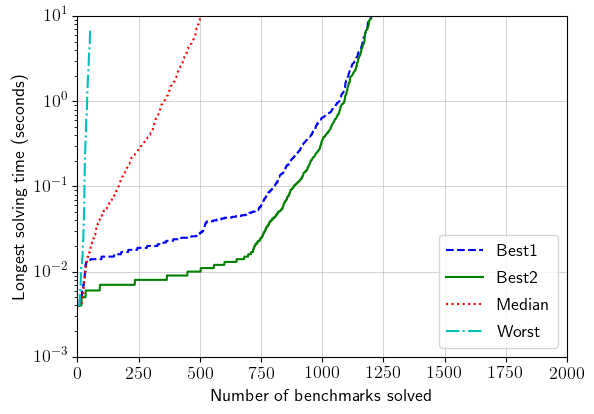
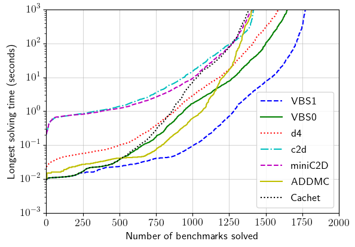

# Analysis
Setup:
- CPU: 2.6 GHz Xeon E5-2650v2
- RAM limit: 24-GB

--------------------------------------------------------------------------------

## Experiment 1: ADDMC heuristics
- Time limit: 10-second
- [Table](./tables/exp1lin0.txt)
- Figure:  
  

--------------------------------------------------------------------------------

## Experiment 2: model counters
- Time limit: 1000-second
- [Table](./tables/exp2.txt)
- Figure:  
  
